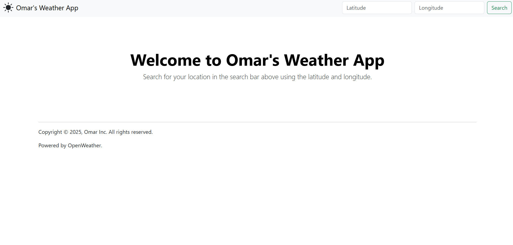
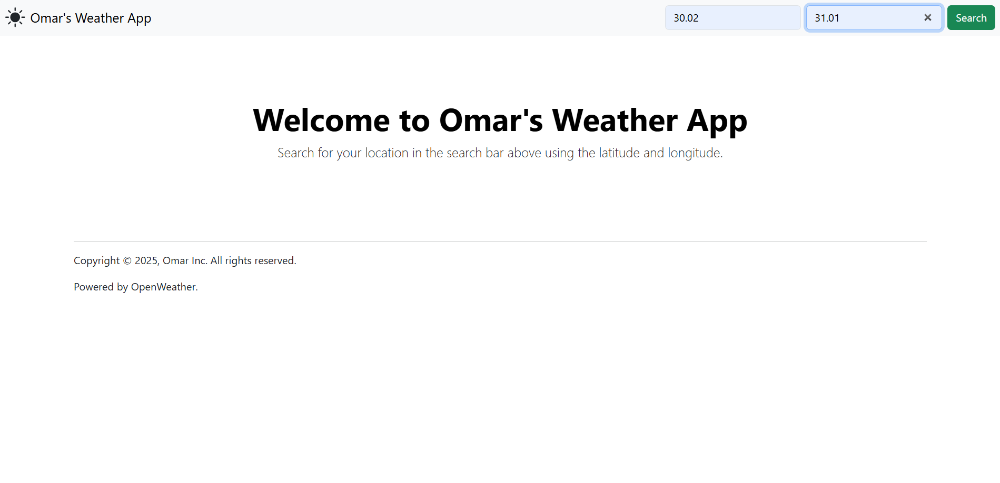
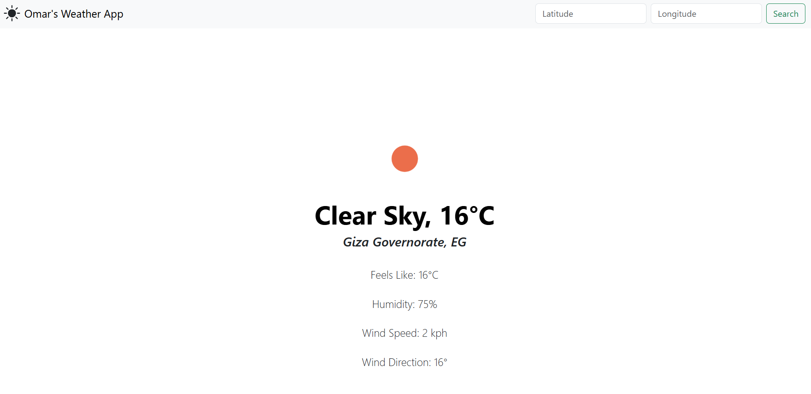

# About the web app
This is a simple web app that uses Node JS, Express JS, EJS, and OpenWeatherMap API to fetch live weather data.

# Setup Instructions
To use, follow the steps below:
1. Make sure you have Node installed on your computer.
2. Go to https://openweathermap.org/ and sign up for free to get your API key.
3. Go to secrets.js in the project files and edit the 'apiKey' variable to match your API key.
5. In the terminal, navigate to the same directory that contains "index.js" then execute "npm i" after you initialize npm.
6. Use node to start index.js
7. Go to http://localhost:3000/ to access the web app.

# Usage Instructions
1. In the search bar above, enter the latitude and longitude of your location.
2. The web app will fetch the current weather data of your location.

# Web App Screenshots

Home page

Searching using the navbar.

